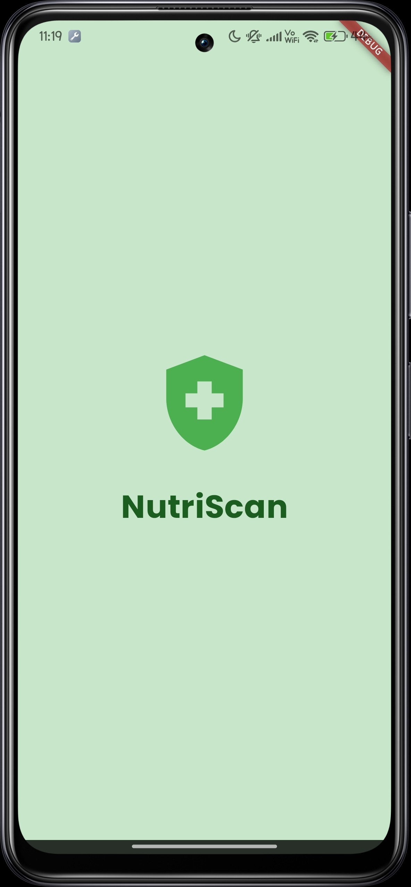
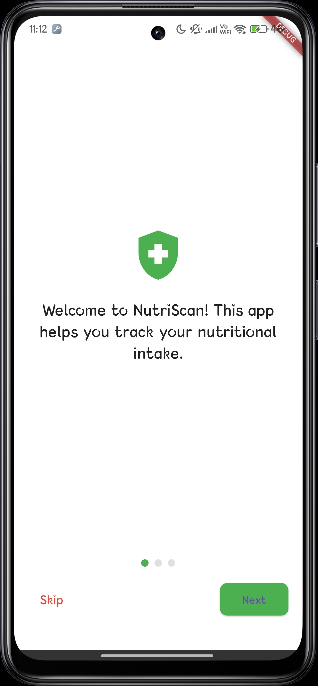
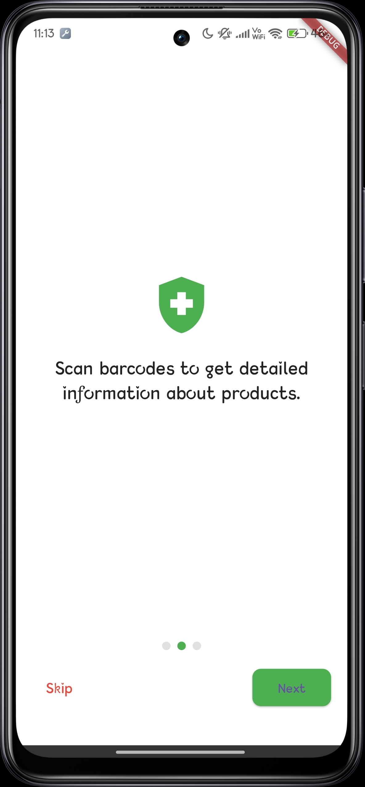
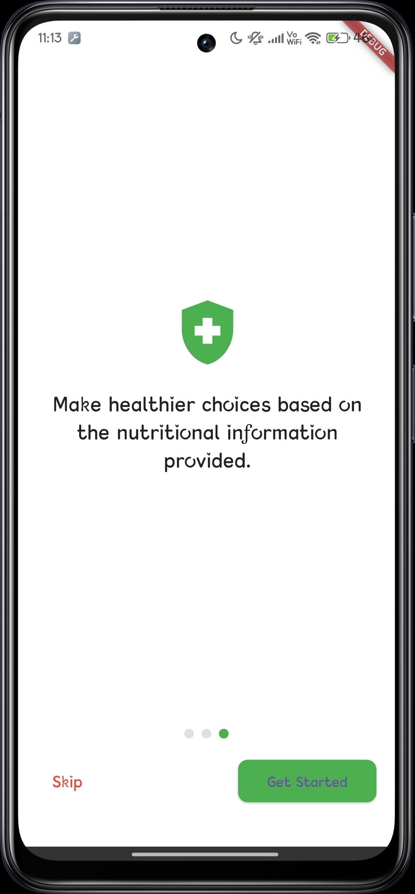
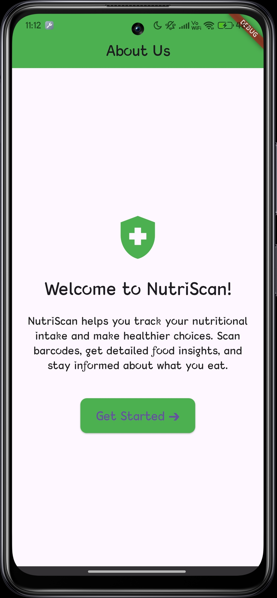
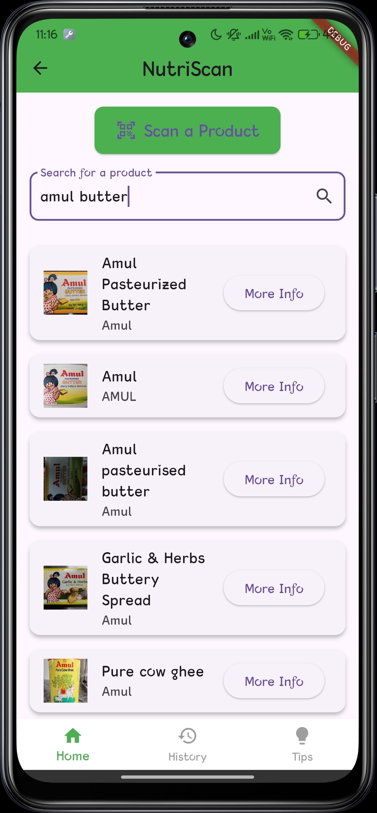
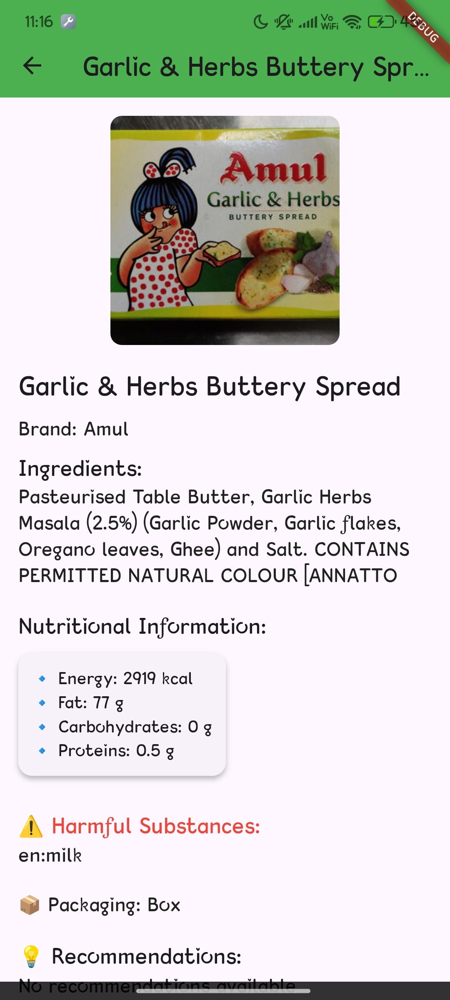
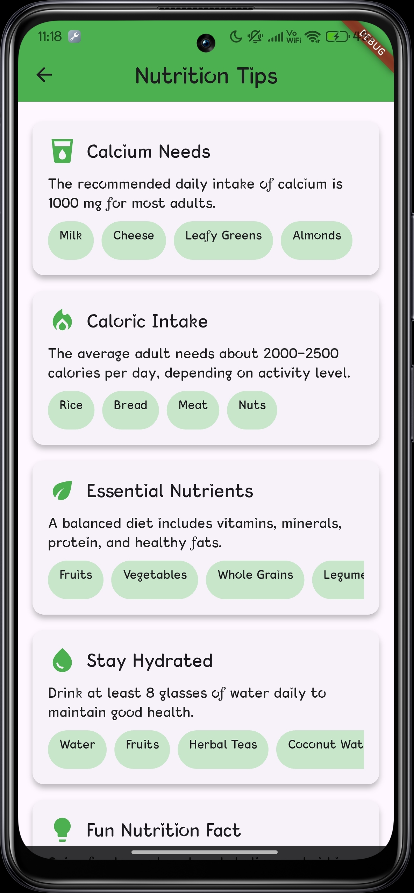
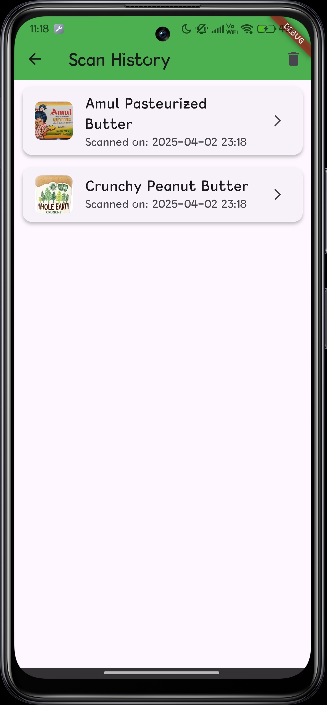

# 🥗 NutriScan - AI-Powered Nutrition Scanner App

NutriScan is a sleek and intuitive Flutter app designed to help users make informed decisions about the food they consume. By simply scanning product barcodes, users receive instant access to nutritional information, potential allergens, harmful ingredients, and personalized health tips — powered by AI and Open Food Facts API.

> ⚠️ **Note**: This is a UI + partially functional prototype designed for educational and demonstrational purposes.

---

## 🌟 Features

- 📷 **Barcode Scanner** – Scan packaged food items and get instant nutritional info.
- 🧠 **AI-Powered Insights** – Understand ingredients better with AI-based suggestions and warnings.
- 📜 **Scan History** – View previously scanned products at any time.
- 💡 **Nutrition Tips** – Handy health and nutrition tips to guide daily decisions.
- 🌗 **Light/Dark Mode** – Toggle between light and dark themes.
- 🧪 **Banned Substances Alert** – Get warnings if scanned products contain any banned or harmful ingredients.
- 🇮🇳 **Indian Consumer Friendly** – Tailored with locally relevant tips and food products.

---

## 📲 Screenshots

| Splash | Intro 1 | Intro 2 | Intro 3 |
|--------|---------|---------|---------|
|  |  |  |  |

| Start Screen | Search Screen | Result Screen |
|--------------|----------------|----------------|
|  |  |  |

| Tips Screen | History Screen |
|-------------|----------------|
|  |  |

---

## 🧱 Tech Stack

- **Frontend:** Flutter (Dart)
- **State Management:** `Provider`
- **Design Style:** iOS-inspired, glassmorphism aesthetic
- **API Used:** [Open Food Facts](https://world.openfoodfacts.org/data)
- **Local Storage:** SharedPreferences
- **Platform:** Android (iOS-ready)

---

## 🔧 Installation & Setup

1. **Clone the repo**
   ```bash
   git clone https://github.com/ShubhZ06/NutriScan.git
   cd NutriScan
