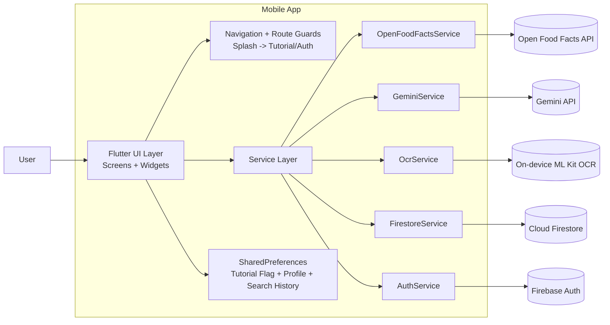
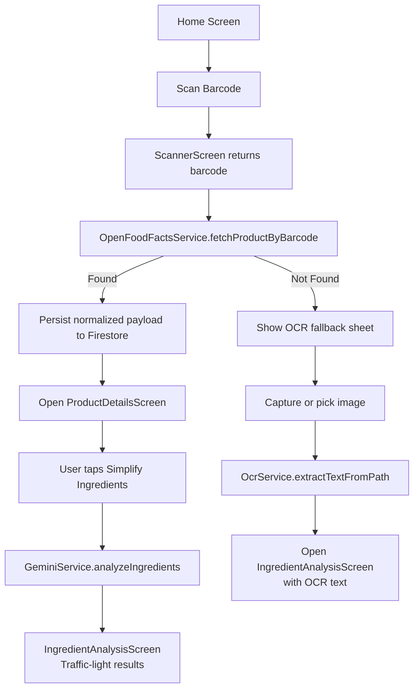
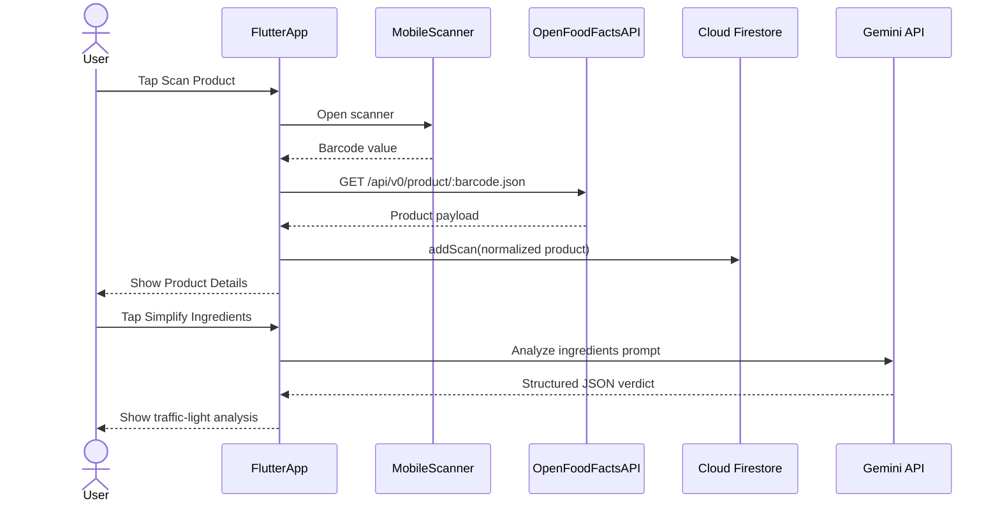

# NutriScan

NutriScan is a Flutter mobile app for food product scanning and ingredient safety analysis.
It combines barcode lookup (Open Food Facts), OCR fallback (ML Kit), AI-based ingredient interpretation (Gemini), and user-level scan history (Firebase).

## Current Feature Set

- Email/password authentication with Firebase Auth
- Onboarding gate with tutorial completion persisted in SharedPreferences
- Barcode scanning flow with Mobile Scanner
- Product fetch/search via Open Food Facts API
- Product detail view with nutrition and ingredient breakdown
- AI ingredient analysis with traffic-light verdict (green/yellow/red)
- OCR fallback for label text extraction when barcode product is missing
- Per-user scan history stored in Cloud Firestore
- Profile form persisted locally in SharedPreferences

## Tech Stack

- Flutter + Dart
- Firebase Core, Auth, Firestore
- Open Food Facts public API
- Google Gemini API via google_generative_ai
- Google ML Kit Text Recognition + image_picker (OCR flow)
- SharedPreferences for local app state and profile data

## Architecture Overview


```mermaid
flowchart LR
      U[User] --> UI[Flutter UI Layer\nScreens + Widgets]

      subgraph Client[Mobile App]
         UI --> NAV[Navigation + Route Guards\nSplash -> Tutorial/Auth]
         UI --> SVC[Service Layer]
         SVC --> OFF[OpenFoodFactsService]
         SVC --> GEM[GeminiService]
         SVC --> OCR[OcrService]
         SVC --> FS[FirestoreService]
         SVC --> AUTH[AuthService]
         UI --> LOCAL[SharedPreferences\nTutorial Flag + Profile + Search History]
      end

      OFF --> OFFAPI[(Open Food Facts API)]
      GEM --> GEMAPI[(Gemini API)]
      OCR --> MLKIT[(On-device ML Kit OCR)]
      AUTH --> FBA[(Firebase Auth)]
      FS --> FDB[(Cloud Firestore)]
```

## Runtime Flow (Scan + Analyze)


```mermaid
flowchart TD
      A[Home Screen] --> B[Scan Barcode]
      B --> C[ScannerScreen returns barcode]
      C --> D[OpenFoodFactsService.fetchProductByBarcode]
      D -->|Found| E[Persist normalized payload to Firestore]
      E --> F[Open ProductDetailsScreen]
      F --> G[User taps Simplify Ingredients]
      G --> H[GeminiService.analyzeIngredients]
      H --> I[IngredientAnalysisScreen\nTraffic-light results]

      D -->|Not Found| J[Show OCR fallback sheet]
      J --> K[Capture or pick image]
      K --> L[OcrService.extractTextFromPath]
      L --> M[Open IngredientAnalysisScreen\nwith OCR text]
```

## Sequence Diagram (Happy Path)


```mermaid
sequenceDiagram
      actor User
   participant App as FlutterApp
      participant Scanner as MobileScanner
   participant OpenFoodFacts as OpenFoodFactsAPI
      participant Firestore as Cloud Firestore
      participant Gemini as Gemini API

      User->>App: Tap Scan Product
      App->>Scanner: Open scanner
      Scanner-->>App: Barcode value
   App->>OpenFoodFacts: GET /api/v0/product/:barcode.json
   OpenFoodFacts-->>App: Product payload
      App->>Firestore: addScan(normalized product)
      App-->>User: Show Product Details
      User->>App: Tap Simplify Ingredients
      App->>Gemini: Analyze ingredients prompt
      Gemini-->>App: Structured JSON verdict
      App-->>User: Show traffic-light analysis
```

## Data Ownership

- Cloud Firestore
   - Per-user scan history under users/{uid}/scan_history
   - Only normalized, Firestore-safe primitive fields are saved
- SharedPreferences
   - tutorial_completed_v1
   - user_profile_v1
   - search_history
- In-memory only
   - Runtime UI state, current search results, temporary OCR text

## Firestore Data Model

```mermaid
flowchart TD
         A[(Cloud Firestore)] --> B[users\nCollection]
         B --> C[{uid}\nUser Document]
         C --> D[scan_history\nSubcollection]
         D --> E[{scanId}\nScan Document]

         E --> F[code: string|null]
         E --> G[product_name: string|null]
         E --> H[brands: string|null]
         E --> I[image_url: string|null]
         E --> J[ingredients_text: string|null]
         E --> K[allergens: string|null]
         E --> L[packaging: string|null]
         E --> M[recommendations: string|null]
         E --> N[nutriments: map]
         E --> O[scan_timestamp: server timestamp]

         N --> P[energy: number|string|bool|null]
         N --> Q[fat: number|string|bool|null]
         N --> R[carbohydrates: number|string|bool|null]
         N --> S[proteins: number|string|bool|null]
```

Document path pattern:

```text
users/{uid}/scan_history/{scanId}
```

Example scan document schema:

```json
{
   "code": "8901234567890",
   "product_name": "Sample Protein Bar",
   "brands": "NutriBrand",
   "image_url": "https://images.openfoodfacts.org/.../front.jpg",
   "ingredients_text": "Dates, whey protein, cocoa, emulsifier (INS 322)",
   "allergens": "en:milk",
   "packaging": "wrapper",
   "recommendations": null,
   "nutriments": {
      "energy": 420,
      "fat": 12.5,
      "carbohydrates": 55,
      "proteins": 18
   },
   "scan_timestamp": "<Firestore Timestamp>"
}
```

Notes:

- The app writes scan_timestamp using FieldValue.serverTimestamp().
- Nutriments values are normalized to Firestore-safe primitives.
- The app currently persists scan history in Firestore; profile data remains in SharedPreferences.

## Key App Modules

- Entry and routing: lib/main.dart
- Screens: lib/screens/
- Services: lib/services/
- Models: lib/models/
- Reusable widgets: lib/widgets/

## Environment Variables

Create a .env file in project root:

```env
GEMINI_API_KEY=your_api_key_here
GEMINI_MODEL=gemini-2.5-flash
```

## Setup

1. Clone and install dependencies

```bash
git clone https://github.com/ShubhZ06/NutriScan.git
cd NutriScan
flutter pub get
```

2. Configure Firebase

- Add Android firebase config file at android/app/google-services.json
- Ensure Firebase project has Auth (email/password) and Firestore enabled

3. Configure environment file

- Add .env in root with Gemini credentials

4. Run app

```bash
flutter run
```

## Known Operational Notes

- Gemini quota/rate-limit errors are handled and surfaced with actionable retry/billing guidance.
- Firestore writes use normalized payloads to avoid invalid nested structures from raw Open Food Facts responses.

## License

This project is licensed under the LICENSE file in this repository.
